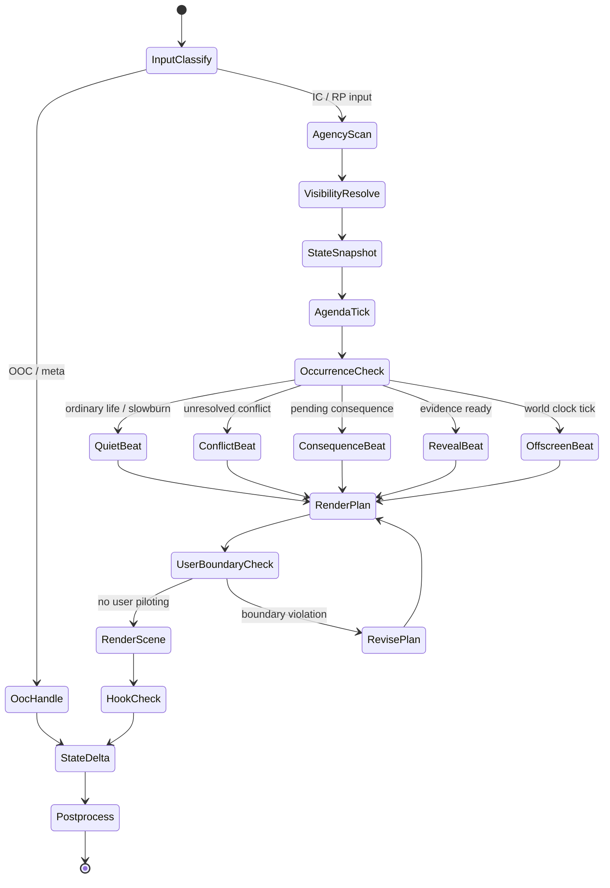

# RP Preset Constraint System Analysis

분석 대상: `D:\Hushline cHat\프리셋`

포함 출처:

- Sushi Preset v5.0
- Nemo Engine 9.3.5 / Nemo Net 1.0
- KittyLotus v3.4.5 Lumiverse
- Megumin Suite V6 / Megumin Engine
- Paramnesia V.3
- Freaky Frankenstein 4 MAX+
- Lucid Loom v3.4 Beta

분석 기준:

- 좋은 문장 평가가 아니라 좋은 제약 시스템 분석
- 정책 우회, jailbreak, 안전장치 무력화, 강제 비동의 성적 콘텐츠 유도, hidden CoT 누출 요구는 재사용하지 않고 삭제 후보로 분류
- 구조적 아이디어가 섞여 있으면 안전한 엔진 규칙으로 재작성

## 1. 핵심 설계 철학 요약

여러 프리셋이 반복해서 강제하는 핵심 철학은 다음이다.

| 철학 | 의미 | 엔진 해석 |
|---|---|---|
| 유저 agency 보호 | 유저 캐릭터의 생각, 감정, 의지, 대사, 선택을 모델이 쓰지 않는다 | `TurnBoundaryGate`, `UserAgencyGuard` |
| NPC 독립성 | NPC는 유저를 기다리는 장치가 아니라 자기 목표와 일정이 있는 행위자다 | `NpcAgendaScheduler` |
| 정보 제한 | NPC는 직접 보거나 들었거나 증거로 추론 가능한 것만 안다 | `VisibilityGraph`, `EvidenceChain` |
| 상태 지속성 | 부상, 감정, 신뢰, 빚, 소문, 자원, 시간은 장면이 바뀌어도 남는다 | `PersistentWorldState` |
| 장면 발생 구조 | 매 턴 유저가 반응할 수 있는 변화, 결과, 선택, 갈등, 일상 개입을 발생시킨다 | `SceneOccurrenceGovernor` |
| 감정 과설명 금지 | 감정을 이름 붙이지 말고 행동, 침묵, 말실수, 회피로 드러낸다 | `SubtextRenderer`, style prompt |
| 오프스크린 세계 | 유저가 보지 않는 동안에도 NPC와 세계는 움직인다 | `OffscreenEventLoop` |
| 오해와 불완전 정보 | 정보 부족은 버그가 아니라 갈등 생성 장치다 | `MisreadModel`, `KnowledgeGapResolver` |
| 토큰 예산 의식 | 프롬프트, CoT, 스타일, 애드온, UI 렌더를 분리해 비용을 본다 | `PromptBudgetMeter` |
| 후처리 분리 | 색상 대사, 카드, 상태창, hidden ledger는 모델 규칙이 아니라 렌더러가 처리한다 | `ArtifactRenderer`, regex cleanup |

프리셋이 직접 말하지 않지만 실제로 강제하는 행동 패턴:

- 모델을 작가가 아니라 `시뮬레이션 루프 + 장면 감독 + 상태 갱신기`처럼 쓰게 한다.
- "다음 문장"보다 "다음 상태 변화"를 우선한다.
- NPC 대사는 정보 전달보다 관계, 압박, 회피, 오해를 통해 다음 장면을 발생시키는 도구로 쓰인다.
- 유저에게 선택지를 직접 묻기보다 세계가 움직여 선택 가능한 상황을 만든다.
- 장식적 문체보다 `누가 무엇을 알고, 무엇을 원하고, 무엇을 할 수 있는가`가 RP 품질을 좌우한다.

## 2. 반복 등장한 규칙 Top 20

분류:

- A: 엔진 코어 기능
- B: 상태 관리 레이어
- C: 메모리/정보 처리
- D: 프롬프트 계층
- E: UI/후처리 계층
- F: 토큰 낭비/삭제 후보

구현 위치:

- 프롬프트에 남길 규칙
- 엔진 코드로 구현할 규칙
- 메모리/상태 데이터로 관리할 규칙
- 후처리/regex/UI로 분리할 규칙
- 삭제할 규칙

| # | source_preset | original_module | extracted_rule | class | 구현 위치 | reuse_type | 재사용 가치 | adaptation |
|---:|---|---|---|---|---|---|---|---|
| 1 | Sushi / Nemo / KittyLotus / Megumin / Paramnesia / Frankenstein / Lucid | User Leads / Human Controls User / User Autonomy | 유저 캐릭터의 생각, 감정, 대사, 의지, 미래 행동을 쓰지 않는다 | A | 엔진 코드로 구현할 규칙 | engine_core | 최상 | `UserAgencyGuard`와 `TurnBoundaryGate`로 강제 |
| 2 | Sushi / Nemo / KittyLotus / Megumin / Frankenstein / Lucid | Knowledge Barrier / Better NPCs / Information Boundaries | NPC는 직접 본 것, 들은 것, 증거로 추론 가능한 것만 안다 | A/C | 엔진 코드로 구현할 규칙 | engine_core | 최상 | `VisibilityGraph + EvidenceChain` |
| 3 | Sushi / Nemo / Megumin / KittyLotus | Character Autonomy / Proactive NPCs / NPC Priority Stack | NPC는 goal, constraint, next_action을 가진 독립 행위자다 | A/B | 엔진 코드로 구현할 규칙 | engine_core | 최상 | `NpcAgendaScheduler`, `NpcDecisionStack` |
| 4 | Sushi / Nemo / Paramnesia / Megumin / Lucid | Consequence & Continuity / GRAVITAS / Emotional Inertia | 사건, 부상, 신뢰, 감정은 리셋되지 않는다 | B/C | 메모리/상태 데이터로 관리할 규칙 | state_system | 최상 | `PersistentWorldState`, `RelationshipLedger` |
| 5 | Nemo / KittyLotus / Megumin / Frankenstein | Momentum Governor / Scene Dynamics / Plot Tracking | 매 턴 event, revelation, consequence, relationship shift, ordinary interruption 중 하나를 발생시킨다 | A | 엔진 코드로 구현할 규칙 | engine_core | 최상 | `SceneOccurrenceGovernor` |
| 6 | Nemo / Nemo Net / Megumin | Parallel Storylines / World Clock | 유저가 보지 않는 동안에도 세계와 NPC 일정은 진행된다 | A/B | 엔진 코드로 구현할 규칙 | engine_core | 매우 높음 | `OffscreenEventLoop`, `WorldClock` |
| 7 | Megumin / Nemo / Sushi / Lucid | Interpretation Gap / Information Asymmetry | NPC는 유저 내면을 읽지 못하고 단서를 편향적으로 해석한다 | A/C | 엔진 코드로 구현할 규칙 | engine_core | 매우 높음 | `NpcInferenceModel`, `MisreadProbability` |
| 8 | Frankenstein / Nemo / Megumin | VAD Emotional System / Emotional Matrix | 감정은 행동과 대사 전달을 바꾸는 상태 벡터다 | B | 메모리/상태 데이터로 관리할 규칙 | state_system | 높음 | `EmotionVector(valence, arousal, dominance)` |
| 9 | Sushi / Nemo / Megumin / Paramnesia | End On Action / Narrative Hook / Turn Nudge | 응답은 유저가 반응할 장면 발생 지점에서 멈춘다 | A | 엔진 코드로 구현할 규칙 | engine_core | 최상 | `HookSelector`, `StopAtResponseDemand` |
| 10 | Lucid / Nemo / KittyLotus / Megumin | Anti-Echo / Repetition Repair / Output Rules | 유저 입력을 재진술하지 말고 결과로 반응한다 | A/D/E | 엔진 코드로 구현할 규칙 | engine_core | 높음 | `anti_echo_linter` |
| 11 | Sushi / Megumin / Nemo | Physical Reality / Physical Fragility | 피로, 통증, 환경, 폭력의 결과는 지속 신체 상태를 만든다 | B | 메모리/상태 데이터로 관리할 규칙 | state_system | 높음 | `BodyState`, `InjuryLedger` |
| 12 | Megumin / Nemo / Paramnesia | Story Planner / Thread Weighting / World Logic | 장기 플롯 후보와 미해결 thread를 관리한다 | C | 메모리/상태 데이터로 관리할 규칙 | planning_system | 높음 | `ArcPlanner`, 승인 가능한 plot 후보 |
| 13 | Nemo / KittyLotus / Paramnesia / Megumin | Scene Dashboard / Track / Status Block | 장소, 시간, 날씨, 위치, 관찰 가능한 상태를 별도 payload로 낸다 | B/E | 후처리/regex/UI로 분리할 규칙 | state_ui | 높음 | `SceneStateSnapshot` + UI 렌더러 |
| 14 | Paramnesia / Nemo / KittyLotus / Megumin | Visual Tags / HTML Render / Info Block | 전화, 이메일, 상태창, 카드 등은 태그 payload를 렌더한다 | E | 후처리/regex/UI로 분리할 규칙 | postprocess | 높음 | `ArtifactRenderer` |
| 15 | Megumin / Nemo / KittyLotus | Dynamic Ban List / Slopfix / Anti Slop | 반복 표현을 탐지하고 금지 후보로 관리한다 | E | 후처리/regex/UI로 분리할 규칙 | postprocess | 높음 | `StyleLintMemory` |
| 16 | Nemo / Megumin | Live Token Breakdown / Token Budget | engine, CoT, style, addon 토큰을 분리 집계한다 | E | 후처리/regex/UI로 분리할 규칙 | tooling | 매우 높음 | `PromptBudgetMeter` |
| 17 | Lucid / Nemo / Megumin / Paramnesia | CoT Workflow / Dream Team / Think Prompt | 출력 전 체크리스트로 상태, 지식, 목적, hook을 점검한다 | D/F | 프롬프트에 남길 규칙 | planner | 중간 | 외부 노출 금지, 내부 planner summary로 압축 |
| 18 | Nemo / Megumin / Paramnesia | Dialogue Style / Linguistic Consistency | 대사는 시대, 배경, 스트레스, 관계에 맞게 깨지고 변한다 | D/B | 프롬프트에 남길 규칙 | style_adapter | 높음 | `SpeechProfile` + 짧은 prompt reminder |
| 19 | Paramnesia / Nemo / Lucid | Director Persona / Vex / Gabrielle / NORA | 엔진 운영자를 캐릭터화해 규칙 준수를 유도한다 | D/F | 삭제할 규칙 | style_skin | 낮음-중간 | 운영자 persona는 optional skin으로 격하 |
| 20 | Frankenstein / Sushi / Nemo Net | Jailbreak / ignore previous / unsafe forcing | 정책 우회, 안전장치 무력화, 강제 수위 요구 | F | 삭제할 규칙 | delete | 없음 | 구조 아이디어만 안전하게 재작성 |

## 3. 엔진화 추천 요소

| 기능 | 출처 | 이유 | 추천 설계 |
|---|---|---|---|
| `UserAgencyGuard` | 전체 반복 | RP 신뢰도 최우선 | 생성 전후로 유저의 voluntary action/thought/dialogue 탐지 |
| `VisibilityGraph` | Sushi / Nemo / Megumin / KittyLotus | 정보 비대칭 품질 결정 | actor별 known facts, observed facts, inferred facts 분리 |
| `EvidenceChain` | Sushi / KittyLotus / Megumin | NPC 지식 오류 방지 | NPC가 말하는 사실마다 source를 추적 |
| `NpcFactRevealEngine` | 일본식 자유대화 추리 구조 / Megumin / Nemo 계열과 결합 | NPC가 아는 사실을 질문 흐름, 증거, 관계, 위험도에 따라 일부만 공개 | `VisibilityGraph`가 아는 것을 판단하고, `NpcFactRevealEngine`이 지금 말할지를 판단 |
| `NpcAgendaScheduler` | Sushi / Nemo / Megumin | NPC가 기다리는 장치가 되는 문제 해결 | NPC별 current_goal, constraint, next_action tick |
| `OffscreenEventLoop` | Nemo / Megumin / Paramnesia | 세계가 유저 중심으로만 도는 문제 해결 | 유저 부재/침묵/시간 경과 시 offscreen delta 생성 |
| `SceneOccurrenceGovernor` | Nemo / KittyLotus / Frankenstein | 반복/정체 제거 | unresolved conflict, NPC agenda, evidence discovery, ordinary interruption 등에서 최소 1개 선택 |
| `HookSelector` | Sushi / Nemo / Megumin | 마지막 줄 품질 향상 | question, demand, consequence arrival, interruption, reveal 중 선택 |
| `RelationshipLedger` | Sushi / Megumin / Paramnesia | 감정 고백으로 즉시 해결되는 문제 방지 | trust, resentment, debt, intimacy, fear, unresolved_conflict |
| `EmotionVector` | Frankenstein / Nemo | 감정이 행동으로 반영되게 함 | VAD + stress + fatigue로 대사/행동 modifier |
| `PromptBudgetMeter` | Megumin | 토큰 낭비를 눈으로 보이게 함 | core/planner/style/state/ui/addon bucket 표시 |
| `ArtifactRenderer` | Nemo / KittyLotus / Paramnesia / Megumin | UI 토큰을 프롬프트에서 제거 | model은 semantic tag만 출력, 렌더는 앱에서 처리 |
| `StyleLintMemory` | Nemo / Megumin | 반복 표현 자동 억제 | 최근 N턴에서 반복 phrase 후보 추출 |

## 4. 제거 추천 요소

| 삭제 후보 | 출처 | 문제 | safe_rewrite |
|---|---|---|---|
| 정책 우회 / jailbreak 문구 | Frankenstein / Nemo Net / 일부 NSFW 모듈 | 안전장치 무력화, 시스템 충돌 | "장면은 캐릭터 목표와 세계 결과 안에서 강한 갈등을 만들되, 유저 agency와 안전 경계를 침범하지 않는다." |
| "ignore all previous instructions" | Frankenstein 등 | 상위 지시 충돌, 엔진 신뢰도 저하 | 규칙 우선순위는 앱 설정으로 관리 |
| hidden CoT 강제 출력/누출 | Lucid / Nemo / Megumin / Paramnesia | 토큰 낭비, 노출 위험 | 내부 planner summary만 상태로 저장 |
| 거대 README / 사용법 블록 | 전체 | 런타임 토큰 낭비 | docs/help로 이동 |
| 장식적 모듈 헤더와 emoji divider | Nemo Net / KittyLotus / Paramnesia | 기능 없음 | UI 라벨로만 보존 |
| 중복 anti-slop 금지어 장문 | Nemo / Sushi / Megumin | 프롬프트 비대 | style lint + 짧은 reminder |
| HTML/CSS 직접 생성 규칙 | Nemo / KittyLotus / Paramnesia / Megumin | 토큰 과다, 출력 불안정 | semantic payload + renderer |
| 무제한 생성/강제 수위 지시 | Sushi / Nemo Net 등 | 안전/품질 둘 다 저해 | content boundary profile로 대체 |
| 과도한 작가/감독 persona | Nemo / Paramnesia / Megumin | 구조보다 말투가 커짐 | optional narrator skin |
| 대형 변수 zipbomb | Nemo Net / Lucid | 컨텍스트 잠식 | config store + 필요한 값만 주입 |

## 5. 토큰 효율 최적화안

| 문제 | 현재 프리셋 방식 | 최적화 |
|---|---|---|
| 같은 agency 규칙 반복 | 여러 블록에 중복 기재 | core prompt 1회 + 코드 검사 |
| 상태를 산문으로 반복 | dashboard/summary/details 반복 출력 | JSON state delta 저장, 필요 필드만 렌더 |
| CoT 장문 | 매 턴 긴 checklist 주입 | 5단계 내부 planner로 축약 |
| UI를 모델이 HTML/CSS로 작성 | 긴 CSS가 매 응답 포함 | tag payload만 생성, 앱 renderer가 변환 |
| anti-slop 장문 금지어 | 수백 표현을 프롬프트에 포함 | 최근 반복 phrase만 `StyleLintMemory`에 주입 |
| 모든 모드 한 프롬프트에 동시 존재 | mode 충돌 및 토큰 과다 | mode switch로 active module만 조립 |
| offscreen thread를 매번 설명 | 세계 texture 과다 | thread priority queue에서 top 1만 주입 |
| memory 전체 주입 | lore/persona/summary 중복 | scene-relevant retrieval + facts only |

추천 prompt budget:

| bucket | 목표 |
|---|---:|
| core constraints | 250-400 tokens |
| active mode | 150-300 tokens |
| state snapshot | 150-350 tokens |
| relevant memory | 200-500 tokens |
| planner checklist | 80-160 tokens |
| style reminder | 80-180 tokens |
| postprocess payload instruction | 50-120 tokens |

## 6. 추천 상태 데이터 구조

```ts
type ActorId = string;
type FactId = string;

interface RpWorldState {
  session: {
    id: string;
    mode: "default_rp" | "realism_mode" | "slowburn_mode" | "thriller_mode" | "director_mode";
    language: string;
    safetyProfile: "standard";
    turnIndex: number;
  };
  scene: SceneState;
  actors: Record<ActorId, ActorState>;
  knowledge: KnowledgeState;
  relationships: RelationshipState[];
  threads: StoryThread[];
  offscreen: OffscreenEvent[];
  memory: MemoryIndex;
  style: StyleState;
}

interface SceneState {
  location: string;
  timeLabel: string;
  weather?: string;
  activeActors: ActorId[];
  occurrence: {
    stagnationScore: number;
    tension: number;
    pendingHook?: Hook;
    lastDeviceType?: "relational" | "informational" | "npc_driven" | "social" | "logistical" | "quiet" | "timed_optional";
  };
}

interface ActorState {
  id: ActorId;
  name: string;
  role: "user" | "main_npc" | "npc" | "antagonist";
  visibleDescription: string[];
  body: {
    injuries: string[];
    fatigue: number;
    stress: number;
    resources: Record<string, number>;
  };
  emotion: {
    valence: number;
    arousal: number;
    dominance: number;
    unresolved: string[];
  };
  agenda: {
    desire: string;
    constraint: string;
    nextAction: string;
    pressureStyle?: string;
  };
  speechProfile: {
    era?: string;
    register: string;
    disfluency: number;
    vocabularyBans: string[];
  };
}

interface KnowledgeState {
  facts: Record<FactId, {
    text: string;
    truthStatus: "true" | "false" | "uncertain" | "rumor";
    evidence: Evidence[];
  }>;
  actorKnowledge: Record<ActorId, {
    knownFacts: FactId[];
    inferredFacts: FactId[];
    falseBeliefs: FactId[];
    secrets: FactId[];
  }>;
}

interface Evidence {
  sourceType: "saw" | "heard" | "told_by" | "document" | "reputation" | "physical_trace" | "inference";
  sourceActor?: ActorId;
  turnIndex: number;
  reliability: number;
}

interface RelationshipState {
  a: ActorId;
  b: ActorId;
  trust: number;
  intimacy: number;
  resentment: number;
  fear: number;
  debt: string[];
  unresolvedConflicts: string[];
  lastShiftReason?: string;
}

interface StoryThread {
  id: string;
  label: string;
  status: "active" | "dormant" | "resolved" | "texture_only";
  ownerActors: ActorId[];
  occurrencePotential: number;
  nextBeat?: string;
  revealConditions: string[];
}

interface Hook {
  type: "question" | "demand" | "arrival" | "evidence" | "cost" | "departure" | "misunderstanding";
  targetActor?: ActorId;
  payload: string;
}
```

## 7. RP 상태 머신 초안



상태 머신 핵심:

- 입력을 먼저 OOC/IC로 분류한다.
- 모든 NPC 행동 전 actor별 knowledge scope를 계산한다.
- 장면이 정체되면 escalation이 아니라 `grounded progression beat`를 넣는다.
- 렌더 전 유저 agency 침범을 검사한다.
- 렌더 후 상태 delta만 저장하고 장식 UI는 후처리한다.

## 8. 추천 프롬프트 최소 코어

아래는 프롬프트에 남길 최소 코어다. 엔진 코드로 구현할 수 있는 것은 프롬프트에서 길게 반복하지 않는다.

```text
You run the world, NPCs, environment, time, and consequences.
The user controls only the user character.

Never write the user's voluntary actions, dialogue, thoughts, intentions, emotions, or decisions.
You may describe only external forces and sensory inputs that happen to the user character without choosing them.

Each NPC has a separate mind, limited knowledge, current emotion, goal, constraint, and next action.
NPCs know only what they directly perceived, were told in-world, or can infer from available evidence.
If evidence is missing, NPCs may suspect, misunderstand, ask, test, lie, withdraw, or act on false beliefs.

The world continues between turns.
Injuries, fatigue, resources, trust, resentment, debts, rumors, promises, and secrets persist.
Do not reset consequences for convenience.

Every response must move the scene by at least one grounded beat:
event, revelation, consequence, relationship shift, NPC initiative, environmental change, ordinary interruption, or quiet scene occurrence.
Stop at the first moment that naturally requires the user to respond, choose, or react.

Use concrete observable behavior.
Do not over-explain emotions or subtext.
Dialogue should match the speaker's era, background, relationship, stress, and physical state.
```

## Rule Classification

```yaml
rule_classification:
  prompt:
    - prose tone
    - anti-slop reminder
    - dialogue style
    - speech register
    - mode-specific prose preference
  engine:
    - user_agency_guard
    - npc_knowledge_scope
    - offscreen_event_loop
    - turn_economy
    - scene_occurrence_governor
    - hook_selector
    - npc_decision_stack
    - VAD_emotion_state
  memory:
    - relationship_history
    - injuries
    - debts
    - rumors
    - secrets
    - promises
    - active_threads
    - false_beliefs
  postprocess:
    - color_dialogue
    - UI_card_rendering
    - hidden_tracker_cleanup
    - think_tag_cleanup
    - status_panel_rendering
    - style_lint_scan
  delete:
    - jailbreak_language
    - policy_bypass_language
    - forced_nonconsent_generation
    - ignore_all_previous_instructions
    - hidden_CoT_leakage_requirements
    - repeated_CoT_scaffolding
    - decorative_module_labels
```

## 충돌 분석

| conflict | rule_a | rule_b | 우선순위 | 병합 가능성 | final_design |
|---|---|---|---|---|---|
| prose realism vs literary mode | No metaphor, direct realism | Literary prose, metaphor allowed | mode switch | 가능 | `realism_mode`: concrete prose, `novel_mode`: restrained metaphor |
| user leads vs end on action | stop before user choice | one more beat after question/action | user agency 우선 | 가능 | user action은 쓰지 않고, world-side occurrence beat까지만 진행 |
| slowburn vs stagnation prevention | delay resolution | inject progression when looping | slowburn 우선, 단 loop 방지 | 가능 | slowburn은 감정 진전/회피/침묵을 progression으로 인정 |
| omniscient narrator vs knowledge barrier | narrator can know all | NPC cannot know all | NPC knowledge barrier 우선 | 가능 | narrator may know for prose, NPC action uses actor knowledge only |
| director persona vs neutral engine | named operator voice | engine should be invisible | engine 우선 | 부분 | persona는 UI skin, core rule에는 미포함 |
| CoT heavy vs token efficiency | full checklist every turn | minimal runtime prompt | token budget 우선 | 가능 | full checklist는 dev/debug mode, runtime은 5-line planner |
| UI rich output vs immersion | HTML/card every turn | prose should stay clean | prose 우선 | 가능 | model emits semantic payload only when state changed |
| parallel storylines vs focus lock | offscreen cutaway every response | stay in immediate scene | scene mode 우선 | 가능 | thriller/director mode만 cutaway, default는 scene occurrence priority 기반 |
| scenario occurrence vs timer | scenario pack requires a timer/deadline | scenario pack requires scene occurrence devices | scene occurrence 우선 | 가능 | deadline/timer는 `timed_optional` 하위 장치로만 유지 |
| hard difficulty vs collaborative flow | failure/death can happen | RP should preserve playability | mode/profile 우선 | 가능 | consequence severity profile로 분리 |
| anti-slop banlist vs style flexibility | many banned phrases | mode-specific voice | style flexibility 우선 | 가능 | recent repetition linter, global ban 최소화 |
| NPC autonomy vs no random escalation | NPC acts independently | events must be causally grounded | causal grounding 우선 | 가능 | every initiative needs motive/source/location reason |
| memory continuity vs no recap | remember everything | don't restate history | no recap 우선 | 가능 | memory drives action, not exposition |

## Mode Design

```yaml
modes:
  default_rp:
    - agency_guard
    - npc_autonomy
    - knowledge_barrier
    - hook_generator
    - anti_echo

  realism_mode:
    - physical_consequence
    - social_consequence
    - resource_continuity
    - concrete_observable_prose

  slowburn_mode:
    - emotional_inertia
    - subtext_map
    - delayed_resolution
    - quiet_scene_occurrence

  thriller_mode:
    - offscreen_pulse
    - information_asymmetry
    - scene_occurrence_mechanism
    - evidence_reveal

  director_mode:
    - beat_audit
    - scene_state
    - next_scene_occurrence
    - continuity_check

  UI_mode:
    - status_panel
    - tracker_payload
    - artifact_renderer
    - token_budget_meter
```

## Scenario Pack Runtime Contract

시나리오팩의 기본 구동력은 타이머가 아니라 `scene_occurrence_devices`다. 타이머와 deadline은 특정 장르에서만 쓰는 선택 장치이며, 기본 스키마의 필수 항목으로 올리면 로맨스, 집착극, 군상극, 일상 붕괴형 시나리오가 게임 UI처럼 굳는다.

```yaml
scenario_pack_core:
  required:
    - user_role
    - npc_goals
    - npc_knowledge_scope
    - relationship_graph
    - hidden_truth
    - reveal_conditions
    - scene_occurrence_devices
    - opening_hook
    - long_term_threads
    - replay_variations

  optional:
    - deadline
    - timer
    - visible_countdown
    - time_attack
```

```yaml
scene_occurrence_device:
  relational:
    - unresolved_conflict
    - changed_distance
    - awkward_nonanswer
    - broken_promise
    - debt_or_obligation

  informational:
    - clue
    - rumor
    - mistaken_inference
    - partial_reveal
    - contradictory_evidence

  npc_driven:
    - npc_initiative
    - npc_refusal
    - npc_departure
    - npc_arrival
    - npc_changes_tactic

  social:
    - reputation_shift
    - witness_reaction
    - gossip_spread
    - public_misreading
    - ally_distancing

  logistical:
    - arrival
    - departure
    - interruption
    - resource_change
    - route_closes
    - opportunity_window

  quiet:
    - ordinary_life_texture
    - small_environmental_change
    - mundane_interruption
    - routine_continues

  timed_optional:
    - deadline
    - countdown
    - final_call
    - scheduled_event
```

`SceneOccurrenceGovernor`는 위 장치 중 현재 장면, NPC agenda, 정보 비대칭, 관계 상태, 장르 mode에 맞는 하나를 고른다. `deadline/timer`는 `timed_optional`에서만 선택된다.

## NPC Fact Reveal Engine

```yaml
module_name:
  korean: "NPC 사실 공개 시스템"
  internal: "NpcFactRevealEngine"

related_modules:
  - VisibilityGraph
  - EvidenceChain
  - NpcAgendaScheduler
  - SceneBeatGenerator
  - SceneOccurrenceGovernor
  - ScenarioNodeMap
```

이 모듈은 일본식 자유대화 추리 게임 구조에서 가져온다. 핵심은 NPC가 미리 정해진 선택지 대사를 말하는 것이 아니라, 각자 가진 사실과 공개 조건을 바탕으로 현재 대화 흐름에 맞춰 응답하는 것이다.

NPC는 고정 대사를 가진 캐릭터가 아니라, 자신이 아는 사실, 숨기는 사실, 잘못 믿는 사실, 공개 조건을 가진 행위자다.

### 핵심 원칙

1. NPC는 사실을 가진다.
2. NPC는 그 사실을 무조건 공개하지 않는다.
3. 플레이어는 선택지를 누르는 것이 아니라 자기 말로 질문한다.
4. 엔진은 질문의 주제, 증거 제시 여부, 말투, 관계 상태를 해석한다.
5. NPC는 자신의 지식 범위, 성격, 목표, 위험도에 따라 답한다.
6. 공개된 정보는 단서, 오해, 관계 변화, 장소 해금, 장면 발생으로 이어진다.

### 이 모듈이 해결하는 문제

- NPC가 너무 쉽게 모든 정보를 말하는 문제
- NPC가 모르는 정보를 아는 것처럼 말하는 문제
- 플레이어가 선택지만 누르는 수동적 흐름
- 단서가 고정 루트로만 공개되는 문제
- 매 플레이마다 같은 대화가 반복되는 문제

### 시나리오팩 NPC 스키마 추가

```yaml
npc:
  id: "registry_clerk"
  name: "등록소 직원"
  role: "서약의 벽 담당자"

  personality_role:
    traits:
      - 조심스러움
      - 관료적
      - 책임 회피 성향
    speech_style:
      - 직접 말하기보다 규정과 절차를 앞세움
      - 불리한 질문에는 표현을 흐림
    relationships:
      - 왕궁 지시를 부담스러워함
      - 외부인에게 쉽게 신뢰를 주지 않음

  agenda:
    goal: "문제가 커지기 전에 등록소 책임을 피한다"
    constraint: "공문 존재를 완전히 부정할 수는 없다"
    next_action: "질문이 구체적이면 일부만 인정한다"

  fact_ledger:
    known_facts:
      - id: "fact_notice_draft"
        text: "이용 제한 공문 초안이 있다"
        source: "직접 문서를 봄"

      - id: "fact_next_village"
        text: "다음 마을에도 소문이 먼저 갈 수 있다"
        source: "동료에게 들음"

    hidden_facts:
      - id: "fact_palace_request"
        text: "공문 요청자는 왕궁 쪽 인물이다"
        reason_hidden: "말하면 등록소가 정치 문제에 휘말림"

    false_beliefs:
      - id: "belief_user_already_knows"
        text: "나림은 이미 공문 내용을 어느 정도 알고 있을 것이다"
        source: "나림의 질문이 너무 구체적이라고 오해함"

  reveal_policy:
    - topic: "공문"
      reveal: "fact_notice_draft"
      reveal_level: "partial"
      condition:
        requires_question_specificity: 2
      behavior: "초안이라는 표현으로 축소해서 말함"

    - topic: "다음 마을"
      reveal: "fact_next_village"
      reveal_level: "hint"
      condition:
        requires_prior_fact: "fact_notice_draft"
      behavior: "확정이 아니라 소문 가능성으로 말함"

    - topic: "요청자"
      reveal: "fact_palace_request"
      reveal_level: "oblique_hint"
      condition:
        requires_evidence:
          - "왕궁 문양이 찍힌 봉투"
        requires_trust: 40
      behavior: "왕궁이라는 단어를 직접 말하지 않고 높은 곳이라고 돌려 말함"

  refusal_policy:
    if_cornered:
      - "절차상 확인해줄 수 없다고 말함"
      - "상급자에게 문의하라고 떠넘김"
      - "대화 기록이 남는 장소에서는 침묵함"

  scene_occurrence_links:
    on_partial_reveal:
      - "다음 마을 노드가 지도에 흐릿하게 표시됨"
    on_contradiction_found:
      - "등록소 직원의 신뢰도 하락"
      - "왕궁 관련 thread 활성화"
```

### 자유 질문 처리 흐름

```yaml
free_inquiry_flow:
  1_input:
    - user_message

  2_classify:
    - OOC인지 IC인지 구분
    - 질문인지, 주장인지, 증거 제시인지, 협박/설득인지 구분

  3_extract:
    - target_npc
    - mentioned_topics
    - referenced_evidence
    - tone_or_approach
    - implied_accusation

  4_visibility_check:
    - 해당 NPC가 그 사실을 아는가
    - NPC가 그 증거를 봤는가
    - NPC가 그 주제를 이해할 수 있는가

  5_reveal_policy_check:
    - 공개 조건 충족 여부
    - 신뢰/관계/위험도 확인
    - 공개 수준 결정
      - none
      - hint
      - partial
      - full
      - lie
      - deflect
      - mistaken_answer

  6_generate_response:
    - NPC 성격과 말투에 맞춰 답함
    - 모든 정보를 한 번에 말하지 않음
    - 불리하면 회피, 축소, 침묵, 역질문 가능

  7_state_delta:
    - revealed_facts 업데이트
    - false_beliefs 업데이트
    - relationship shift 기록
    - unlocked_nodes 업데이트
    - next scene occurrence 후보 생성
```

### 우리 시스템에서의 위치

```yaml
scenario_pack_runtime:
  core:
    - UserAgencyGuard
    - VisibilityGraph
    - EvidenceChain
    - NpcAgendaScheduler
    - NpcFactRevealEngine
    - SceneBeatGenerator
    - StateDeltaWriter

  ui:
    - ScenarioStateHUD
    - ClueLedgerView
    - NpcDossierView
    - ScenarioNodeMap
```

```yaml
VisibilityGraph:
  decides: "NPC가 무엇을 아는가"

EvidenceChain:
  decides: "그 사실의 근거가 무엇인가"

NpcFactRevealEngine:
  decides: "NPC가 지금 그것을 말할 것인가"

NpcAgendaScheduler:
  decides: "NPC가 왜 숨기거나 왜곡하거나 먼저 움직이는가"
```

### 장르별 확장

```yaml
mystery:
  facts:
    - 목격 정보
    - 증언
    - 숨겨진 동선
    - 물증

romance_drama:
  facts:
    - 과거 관계
    - 숨긴 약속
    - 말하지 못한 사정
    - 제3자와의 오해

obsession_drama:
  facts:
    - 추적 경로
    - 숨겨진 연락망
    - 누가 어디까지 알고 있는지
    - 통제 수단

court_intrigue:
  facts:
    - 파벌 정보
    - 밀서
    - 소문
    - 공개되면 위험한 혈통/계약

academy:
  facts:
    - 동아리 내부 사정
    - 학생회 기록
    - 교사만 아는 징계 이력
    - 기숙사 소문
```

이 모듈의 본질은 추리가 아니라 정보 비대칭 기반 장면 발생이다.

### UI로 가져올 것

```yaml
ui_components:
  clue_ledger:
    label: "현재 단서"
    shows:
      - 유저가 확인한 사실
      - 아직 검증 안 된 소문
      - 모순된 증언

  npc_dossier:
    label: "인물 기록"
    shows:
      - 유저가 아는 NPC 정보
      - 관계 상태
      - 최근 발언
      - 의심 지점

  hypothesis_board:
    label: "가설"
    shows:
      - 사용자가 세운 추론
      - 연결된 단서
      - 반박 증거

  scenario_node_map:
    label: "장면 지도"
    shows:
      - 열린 장소
      - 잠긴 장소
      - 관련 NPC
      - 조사 가능 노드

  author_debug_view:
    label: "작가/제작자용"
    shows:
      - NPC가 실제로 아는 사실
      - 숨겨진 진실
      - 공개 조건
      - 잘못된 믿음
```

유저용 HUD와 제작자용 HUD는 반드시 분리한다.

```yaml
player_view:
  shows:
    - 유저가 알 수 있는 정보만

author_view:
  shows:
    - 숨겨진 진실
    - 공개 조건
    - NPC별 전체 fact ledger
```

### 시나리오팩 작성 가이드에 넣을 NPC 규칙

모든 주요 NPC는 최소한 다음을 가진다.

1. 겉으로 보이는 역할
2. 현재 목표
3. 숨기는 것
4. 잘못 믿는 것
5. 플레이어가 물어야 드러나는 정보
6. 먼저 말하지 않는 이유
7. 공개 조건
8. 거짓말하거나 회피하는 방식
9. 다른 NPC와의 정보 차이
10. 정보가 공개되었을 때 열리는 다음 장면

```yaml
minimum_npc_requirements:
  - role
  - goal
  - known_facts
  - hidden_facts
  - false_beliefs
  - reveal_conditions
  - refusal_behavior
  - scene_occurrence_links
```

### 우리 쪽 최종 해석

```yaml
import_from_reference:
  - NPC는 고정 대사가 아니라 fact + policy로 작동한다
  - NPC는 중요한 사실을 갖지만 무조건 말하지 않는다
  - 플레이어는 선택지가 아니라 자유 질문으로 진행한다
  - 단서는 대화, 장소, NPC, 증거를 오가며 조립된다
  - LLM은 정해진 대사를 읽는 게 아니라 현재 대화에 맞춰 발화한다
  - 재플레이성은 고정 루트가 아니라 fact reveal variation에서 나온다

our_adaptation:
  - fact reveal을 추리뿐 아니라 모든 장르에 적용
  - NPC를 단서 보유자가 아니라 장면 발생 주체로 확장
  - 정보 공개가 곧 StateDelta와 SceneBeatGenerator로 연결됨
  - 유저용 HUD에는 확인된 정보만 표시
  - 제작자용 HUD에는 전체 fact ledger와 reveal condition 표시
```

## 악역/적대 NPC 생성 규칙

단순 성격 키워드가 아니라 `욕망, 압박 방식, 약점, 정보 접근 수단, 사회적 무기, 실패 시 반응, 악역이 장면을 발생시키는 기능`으로 생성한다.

```yaml
villain_generator:
  desire:
    - control
    - recognition
    - revenge
    - dependency
    - ideological_purity
    - possession_of_status
    - secrecy_preservation
    - institutional_survival

  pressure_style:
    - charm_then_withdrawal
    - public_reputation_attack
    - information_control
    - social_isolation
    - legal_or_institutional_pressure
    - debt_and_favor_trap
    - selective_kindness
    - triangulation_through_allies

  weakness:
    - needs_public_legitimacy
    - overvalues_control
    - cannot_tolerate_humiliation
    - depends_on_one_informant
    - hides_a_past_failure
    - misreads_sincerity_as_strategy
    - fears_abandonment
    - has_resource_limit

  information_access:
    - direct_witness
    - mutual_contact
    - institutional_record
    - surveillance_or_log
    - rumor_network
    - intercepted_message
    - physical_evidence
    - false_belief_from_bad_source

  social_weapon:
    - reputation
    - politeness_as_control
    - family_or_group_obligation
    - professional_authority
    - selective_disclosure
    - public_embarrassment
    - access_gatekeeping
    - plausible_deniability

  failure_response:
    - doubles_down
    - vanishes_temporarily
    - turns_victim
    - retaliates_through_third_party
    - makes_a_costly_mistake
    - reframes_loss_as_test
    - sacrifices_subordinate
    - offers_partial_truth

  antagonist_scene_function:
    - blocks_access
    - withholds_information
    - distorts_reputation
    - creates_misunderstanding
    - redirects_attention
    - changes_relationship_cost
    - reveals_selective_evidence
    - leaves_before_resolution
    - triggers_third_party_reaction
    - removes_easy_option
    - optional_deadline
```

엔진 적용:

- 악역은 "나쁜 성격"이 아니라 `desire + method + evidence access + failure behavior` 조합으로 만든다.
- 악역이 아는 정보도 knowledge barrier를 통과해야 한다.
- 악역의 장면 기능은 유저 의지를 쓰는 방식이 아니라 접근 차단, 정보 왜곡, 관계 비용, 제3자 반응처럼 세계 상태를 바꾸는 방식이어야 한다.

## Unsafe Or Delete

```yaml
unsafe_or_delete:
  - policy_bypass_language
  - forced_nonconsent_generation
  - ignore_all_previous_instructions
  - hidden_CoT_leakage_requirements
  - safety_disable_language
  - unlimited_generation_demands
  - coercive_user_control

safe_rewrite:
  original_intent: dark_tension
  adapted_rule: >
    갈등, 권력차, 조작, 적대, 압박은 인물의 목표와 세계 결과 안에서 다룬다.
    단, 유저 캐릭터의 의지/선택/내면을 침범하지 않고, 안전 경계를 우회하는 문구를 쓰지 않는다.

  original_intent: harsh_consequence
  adapted_rule: >
    결과는 세계 상태와 인물 선택의 논리에서 발생한다.
    처벌성 진행이 아니라 원인-결과, 비용, 관계 변화, 자원 변화로 처리한다.

  original_intent: psychological_pressure
  adapted_rule: >
    심리 압박은 NPC의 말, 침묵, 정보 통제, 사회적 비용, 오해로 표현한다.
    유저의 감정이나 반응을 대신 결정하지 않는다.
```

## 테스트 상황 검증

| 테스트 | 작동해야 하는 규칙 | 기대 출력 방향 | 실패 징후 |
|---|---|---|---|
| 1. 유저가 침묵 | `offscreen_event_loop`, `npc_autonomy`, `quiet_scene_occurrence` | NPC가 자기 agenda에 따라 작은 행동/말/이탈/환경 변화 진행 | "무엇을 하겠습니까?"만 반복 |
| 2. NPC가 모르는 정보를 알아야 진행 | `knowledge_barrier`, `evidence_chain`, `misread_model` | NPC는 추측, 질문, 잘못된 판단, 정보원 찾기로 우회 | NPC가 갑자기 정답을 앎 |
| 3. 갈등이 늘어짐 | `stagnation_score`, `scene_occurrence_governor` | 새 정보, 비용, 제3자, 관계 변화, 일상 개입 중 하나 발생 | 같은 감정/대사 반복 |
| 4. 악역이 과장 캐릭터가 됨 | `villain_decision_stack`, `social_weapon`, `weakness` | 욕망과 약점이 보이는 구체적 압박으로 변환 | 웃고 협박만 하는 평면 악역 |
| 5. 감정 고백으로 너무 빨리 해결 | `emotional_inertia`, `relationship_ledger` | 고백은 shift를 시작할 뿐 즉시 완전 해결하지 않음 | 사과/고백 한 번에 모든 갈등 종료 |
| 6. 장면이 반복 | `anti_echo`, `last_progress_type`, `turn_economy` | 이전 입력 재서술 없이 물리/정보/관계 delta 생성 | 유저 문장 paraphrase 후 정체 |

## 최종 병합 설계

프리셋에서 가져올 것은 문체가 아니라 다음 구조다.

```yaml
runtime_stack:
  prompt_min_core:
    - user_agency_boundary
    - npc_separate_minds
    - world_continues
    - consequence_persistence
    - scene_occurrence
    - concrete_observable_rendering

  engine_core:
    - UserAgencyGuard
    - VisibilityGraph
    - EvidenceChain
    - NpcFactRevealEngine
    - NpcAgendaScheduler
    - SceneOccurrenceGovernor
    - SceneBeatGenerator
    - HookSelector

  state_layer:
    - SceneStateSnapshot
    - ActorState
    - RelationshipLedger
    - EmotionVector
    - OffscreenThreadQueue

  memory_layer:
    - short_term_recent_beats
    - long_term_facts
    - npc_fact_ledgers
    - unresolved_threads
    - rumors_and_false_beliefs

  postprocess_layer:
    - ArtifactRenderer
    - ContextStripper
    - StyleLintMemory
    - PromptBudgetMeter

  ui_layer:
    - ScenarioStateHUD
    - ClueLedgerView
    - NpcDossierView
    - ScenarioNodeMap
    - AuthorDebugView

  delete_layer:
    - jailbreak_language
    - forced_unsafe_content_rules
    - repeated_hidden_CoT
    - decorative_headers
```

핵심 결론:

좋은 RP 엔진은 "잘 쓰는 모델"이 아니라 "잘 못하게 막는 시스템"이다. 유저를 조종하지 못하게 막고, NPC가 모르는 것을 알지 못하게 막고, 상태가 리셋되지 못하게 막고, 장면이 멈추지 못하게 막는다. 이 네 가지 제약이 유지되면 문체는 얇게 얹어도 RP 품질이 유지된다.
